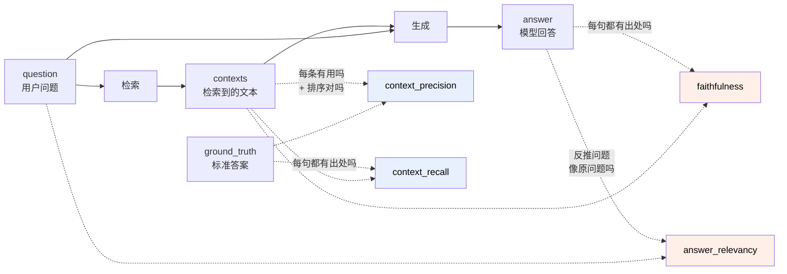

# RAGAS 基础：用 LLM 当裁判来评估 RAG，到底在评什么

> **专题定位**：[RAG 评估系统学习](rag-evaluation/README.md) **第 03 层（生成指标）的深入阅读**。本文默认你已知道 judge 是什么形态、评估流水线每一步产出什么、以及一套确定性指标做参照系 —— 第一次接触请先走专题的 [00](rag-evaluation/00-prerequisites.md) → [03](rag-evaluation/03-generation-metrics.md)（约 1.7 小时），再回来看这里的完整算法与六个坑。
> **记录日期**：2026-08-15
> **关联代码**：`src/observability/evaluation/ragas_evaluator.py`、`_ragas_wrappers.py`、`testset_synthesizer.py`、`composite_evaluator.py`、`config/settings.yaml` § `evaluation`
> **关联依赖**：`ragas==0.1.21`（[pyproject.toml](../../pyproject.toml) 中刻意 pin 死）
> **起因**：项目已经在用 RAGAS 跑评估，但从未系统理解过它的机制。本文回答三个问题：它算的四个指标各自是什么意思、它凭什么能算出来、以及在本项目里它被接在了哪里。

## 置信度标注约定

沿用 [rerank-and-cross-encoder.md](rerank-and-cross-encoder.md)、[skill-vs-rag-knowledge-delivery.md](skill-vs-rag-knowledge-delivery.md) 的约定：

| 标注 | 含义 |
|---|---|
| **【代码】** | 从本项目源码直接读出，可复核 |
| **【实测】** | 本项目历史评估报告中的真实数字，出处标注 run_id |
| **【文献】** | 来自 RAGAS 官方文档与论文（arXiv:2309.15217）及 0.1.x 源码理解，高置信但**版本相关** |
| **【推断】** | 本文作者的判断，**不是共识，引用前请自行核验** |

> ⚠️ 本文描述的算法细节针对 **ragas 0.1.21**。RAGAS 在 0.2 做过一次大重构（指标类改名、`ground_truth` → `reference`、引入 `SingleTurnSample`），**本文的字段名和 import 路径在 0.2+ 上不适用**。项目 pin 死版本正是为此。

---

## 目录

1. [先问一个问题：RAG 为什么不能用准确率来评](#1-先问一个问题rag-为什么不能用准确率来评)
2. [RAGAS 的核心赌注：LLM-as-Judge](#2-ragas-的核心赌注llm-as-judge)
3. [四个核心指标的坐标系](#3-四个核心指标的坐标系)
4. [逐个拆开：每个指标到底怎么算出来的](#4-逐个拆开每个指标到底怎么算出来的)
5. [数据契约：喂给 RAGAS 的四个字段](#5-数据契约喂给-ragas-的四个字段)
6. [RAGAS 的第二个身份：金标合成器](#6-ragas-的第二个身份金标合成器)
7. [它在本项目里被接在哪](#7-它在本项目里被接在哪)
8. [用它必须知道的六个坑](#8-用它必须知道的六个坑)
9. [RAGAS 指标 vs 本项目 custom 指标：分工](#9-ragas-指标-vs-本项目-custom-指标分工)
10. [一句话总结](#10-一句话总结)
11. [附录 A：复现命令](#附录-a复现命令)
12. [附录 B：术语表](#附录-b术语表)

---

## 1. 先问一个问题：RAG 为什么不能用准确率来评

传统机器学习评估很简单：有标准答案，模型输出对上了就是 1，没对上就是 0。

RAG 系统输出的是**一段自然语言**。假设标准答案是「MT5 的组操作建议按账户分别执行，因为批量操作会锁表」，而系统回答「建议逐个账户处理组变更，批量执行期间数据库会加锁影响其他会话」——

这两句话字面重合度极低，任何基于字符串匹配的指标（BLEU、ROUGE、精确匹配）都会给低分。但语义上它们是同一个意思，甚至第二句更详细。

于是有了第一个思路：**用 embedding 算语义相似度**。这确实比字符串匹配好，但仍不够——它只能告诉你「像不像」，不能告诉你**哪里不对**。RAG 的失败模式是分层的：

| 失败层 | 典型表现 | 语义相似度能发现吗 |
|---|---|---|
| 检索没召回 | 答案里缺关键信息 | 只能看出分低，不知道是检索的锅 |
| 检索召回了噪声 | 答案跑偏，掺入无关内容 | 同上 |
| 生成幻觉 | 检索到的资料里根本没这句话，模型编的 | **看不出来**——编得很像标准答案时分反而高 |
| 答非所问 | 内容都对，但没回答用户问的那个点 | 部分能看出 |

**RAGAS 的核心设计就是把这四层拆开分别打分**，而不是给一个笼统的「相似度」。这是它相比「算个余弦」的根本价值。【文献】

---

## 2. RAGAS 的核心赌注：LLM-as-Judge

拆开了，可怎么算？「这句话有没有被检索到的资料支撑」——这是个需要**理解语义并做推理判断**的任务，写不出公式。

RAGAS 的答案是：**再叫一个 LLM 来判**。这个 LLM 叫 **Judge LLM**（裁判模型），它不参与生成答案，只负责打分。

这就是理解 RAGAS 的关键转折点。它不是一个「算法库」，而是**一套精心设计的提示词模板 + 把 LLM 的判断聚合成数字的规则**。你可以粗暴地理解为：

```
RAGAS ≈ 一堆写好的 prompt + 调用 LLM + 把 yes/no 数出来除一除
```

这个理解虽然粗糙，但能立刻推出几个重要后果：

- **它要花钱和时间**。每评一条测试用例，背后是好几次 LLM 调用。
- **它有不确定性**。同一份数据跑两次，分数可能不完全一样（所以配置里 `temperature: 0.0`）。
- **换 Judge 模型 = 换了一把尺子**。不同模型的判断松紧不同，分数不可跨 Judge 比较。
- **Judge 必须与被评估的生成模型异源**，否则是自己批自己的作业。

这四条在你项目的 [config/settings.yaml](../../config/settings.yaml) 里都有对应的注释和约束，不是理论洁癖，是实际踩过的。

> **【实测】** 你项目的报告里专门存了 `judge_llm_identifier` 字段（当前为 `glm:minimax/minimax-m2.7`），就是为了让「这份分数是哪把尺子量的」可追溯。

---

## 3. 四个核心指标的坐标系

RAGAS 0.1.x 有十几个指标，但**核心四件套**是这四个。理解它们最好的方式是放进一个二维坐标系：

|  | **评检索**（Retrieval） | **评生成**（Generation） |
|---|---|---|
| **需要标准答案**（ground_truth） | `context_recall`<br>`context_precision` | — |
| **不需要标准答案** | — | `faithfulness`<br>`answer_relevancy` |

这张表本身就是重要信息：

- **左列**回答「检索模块干得怎么样」，**右列**回答「生成模块干得怎么样」。出了问题先看哪一列低，就知道该改哪个模块。
- **下排两个不需要标准答案**——这意味着 `faithfulness` 和 `answer_relevancy` 可以在**线上生产流量**上跑，不需要人工标注。这是 RAGAS 的一个杀手级特性。【文献】

用你项目最近一次英文全量评估的真实数字填进去：

|  | 评检索 | 评生成 |
|---|---|---|
| 需要 ground_truth | recall **0.833** / precision **0.764** | — |
| 不需要 | — | faithfulness **0.889** / relevancy **0.847** |

> **【实测】** run_id `80a82405`，2026-08-10，42 条英文金标，collection `default_text-embedding-v4`。

读法：生成端（0.85~0.89）明显好于检索端的 precision（0.764）。**说明模型很老实，给它什么它答什么，瓶颈在检索召回的东西不够干净。**这就是拆开评分的价值——一个笼统的「总分 0.83」什么也告诉不了你。

---

## 4. 逐个拆开：每个指标到底怎么算出来的

下面四小节是本文的核心。每个指标我给三样东西：**它问的问题**、**算法步骤**、**低分意味着什么**。

### 4.1 faithfulness（忠实度）——「你是不是在编」

**它问**：回答里的每一句话，能不能从检索到的资料里推出来？

**算法**：【文献】

```
第 1 步（LLM 调用）：把 answer 拆成一组原子陈述（statements）
    answer: "MT5 建议按账户分别执行组操作，因为批量会锁表，且该限制自 build 2000 起生效"
      ↓
    statements: [
      "MT5 建议按账户分别执行组操作",
      "批量操作会锁表",
      "该限制自 build 2000 起生效"
    ]

第 2 步（LLM 调用）：拿 contexts 逐条做 NLI 判定——这条陈述能否被支撑？
    "MT5 建议按账户分别执行组操作"  → contexts 里有 → 1
    "批量操作会锁表"                → contexts 里有 → 1
    "该限制自 build 2000 起生效"    → contexts 里没有 → 0   ← 幻觉！

第 3 步（纯计算）：
    faithfulness = 被支撑的陈述数 / 总陈述数 = 2/3 = 0.667
```

**关键洞察**：faithfulness **完全不看标准答案**。它只问「你说的有没有出处」，不问「你说的对不对」。一个回答可以 faithfulness = 1.0 但答案是错的——因为检索到的资料本身就是错的。它衡量的是**生成模块对检索结果的忠诚度**，不是正确性。

**低分意味着**：模型在瞎编（幻觉）。这几乎总是最严重的问题，所以你项目给它的阈值最高：`0.85`【代码】。

> 🔍 **为什么要先拆成 statements 再判？** 因为直接问「这整段回答有没有依据」，LLM 只能给一个笼统的 yes/no，而真实回答通常是「大部分有依据，一句是编的」。拆开才有分辨率。这个「拆解 → 逐条判 → 求比例」的模式是 RAGAS 四个指标里反复出现的套路。

---

### 4.2 answer_relevancy（答案相关性）——「你是不是答非所问」

**它问**：这个回答，是在回答用户那个问题吗？

**算法**（这个设计很巧妙，值得细看）：【文献】

```
第 1 步（LLM 调用）：给定 answer，反过来生成 N 个「这个回答在回答什么问题」
    （0.1.x 默认 strictness=3，即生成 3 个）

    answer: "组操作建议逐账户执行，批量会锁表"
      ↓ 反向生成
    q1: "为什么 MT5 的组操作要按账户分别做？"
    q2: "批量组操作有什么副作用？"
    q3: "MT5 组操作的推荐做法是什么？"

第 2 步（Embedding 调用，不是 LLM）：
    算这 3 个反向问题与「用户真实问题」的 embedding 余弦相似度

    原问题: "Why is it recommended to perform group operations separately?"
    cos(原问题, q1) = 0.94
    cos(原问题, q2) = 0.78
    cos(原问题, q3) = 0.88

第 3 步：取均值 = 0.867
```

**关键洞察**：这是一个**反向验证**的思路——如果回答确实在回答那个问题，那么从回答倒推出的问题就应该跟原问题很像。如果模型答跑偏了，倒推出的问题就会跟原问题差很远。

同时它还检测 **noncommittal**（推诿式回答）：如果模型说「我不知道」「资料中未提及」，RAGAS 会识别出来并直接给 0 分。【文献】这防止了「什么都不说反而拿高分」的作弊路径。

**注意**：这是四个指标里**唯一需要 embedding 模型**的。这就是为什么你项目的配置里 `evaluation.embedding` 单独有一节，并且注释强调「评估流程所有 embedding 环节 MUST 用同一配置（避免 train-eval skew）」【代码】。

**低分意味着**：答非所问，或者模型在推诿。

---

### 4.3 context_precision（上下文精确率）——「检索到的东西干不干净，且排序对不对」

**它问**：检索回来的 k 个 chunk 里，有用的那些排在前面吗？

**算法**：【文献】

```
第 1 步（LLM 调用，每个 context 一次）：
    对检索到的每个 chunk，判断「它对回答这个问题（参照 ground_truth）有用吗」

    chunk_1 → 有用 (1)
    chunk_2 → 没用 (0)
    chunk_3 → 有用 (1)
    chunk_4 → 没用 (0)
    chunk_5 → 有用 (1)

第 2 步（纯计算，本质是 MAP / Average Precision）：
    对每个「有用」的位置 k，算 precision@k，再对所有有用位置求平均

    位置1 有用 → precision@1 = 1/1 = 1.000
    位置3 有用 → precision@3 = 2/3 = 0.667
    位置5 有用 → precision@5 = 3/5 = 0.600

    context_precision = (1.000 + 0.667 + 0.600) / 3 = 0.756
```

**关键洞察**：它**对顺序敏感**。同样是 5 个里 3 个有用，如果有用的排在 1/2/3 位，得分是 1.0；排在 3/4/5 位，得分只有 0.48。这正是你想要的——RAG 把最相关的塞在最前面，LLM 生成时才最不容易被噪声带偏。

**低分意味着**：召回了太多噪声，或者排序不好。**这是重排（rerank）模块该解决的问题。**

> 💡 这条对你项目特别有意义。CLAUDE.md 里记着「金标无法公正评判重排」——那说的是 `custom__mrr` / `custom__ndcg` 这些**锚定在 chunk_id 上**的指标。而 `ragas__context_precision` 是**让 LLM 现场判断每个 chunk 有没有用**，不依赖任何预先标好的 chunk_id 列表。**【推断】它在结构上不受第一代金标 dense-anchored 缺陷的影响，理论上更适合当重排的裁判。**但这个推断需要实验验证，见 [§8.6](#86-坑六别把-ragas-指标当成免费的午餐) —— 那里有一条 2026-08-17 的重要限定：**它同时是四项里对 judge 漂移最敏感的一项**，用它评重排之前必须先固定 judge。

---

### 4.4 context_recall（上下文召回率）——「该找的东西找全了吗」

**它问**：标准答案里的每一条信息，检索结果里都有出处吗？

**算法**：【文献】

```
第 1 步：把 ground_truth 拆成句子
    ground_truth: "组操作应逐账户执行。批量执行会锁表。锁表期间其他会话被阻塞。"
      ↓
    ["组操作应逐账户执行", "批量执行会锁表", "锁表期间其他会话被阻塞"]

第 2 步（LLM 调用）：逐句判断——这句话能归因到检索到的 contexts 吗？
    "组操作应逐账户执行"       → 能 (1)
    "批量执行会锁表"           → 能 (1)
    "锁表期间其他会话被阻塞"   → 不能，contexts 里没提 (0)   ← 漏召回！

第 3 步：context_recall = 2/3 = 0.667
```

**关键洞察**：注意这是**从标准答案出发**倒查检索结果，方向和 precision 相反。precision 问「检索到的有没有用」，recall 问「该有的检索到没有」。

**低分意味着**：检索漏了。可能是切分粒度不对、embedding 模型不匹配语料、或者 top_k 太小。

---

### 4.5 一图串起来



蓝色 = 评检索，橙色 = 评生成。注意 `faithfulness` 和 `context_recall` 的算法几乎一样（都是「拆句子 → 逐句判能否归因到 contexts」），**区别只在拆的是 answer 还是 ground_truth**。理解了这个对称性，四个指标就记住了。

---

## 5. 数据契约：喂给 RAGAS 的四个字段

不管你怎么组织代码，RAGAS 0.1.x 最终要的就是这四列：【代码】[ragas_evaluator.py:233](../../src/observability/evaluation/ragas_evaluator.py#L233)

```python
dataset = Dataset.from_dict({
    "question":     [query],           # 用户问题
    "answer":       [answer],          # 完整 RAG 链路生成的回答
    "contexts":     [list(contexts)],  # 检索到的文本片段（list[str]）
    "ground_truth": [ground_truth],    # 参考答案
})
```

**最容易踩的坑：`contexts` 必须是文本，不能是 chunk ID。**

这在你项目里被写成了硬性校验，而且注释解释了历史原因：【代码】

```python
if not contexts or not isinstance(contexts, list):
    raise ValueError(
        "RagasEvaluator requires 'contexts' (list[str] of retrieved "
        "text chunks). Passing chunk IDs is not supported — the metric "
        "would be meaningless. ..."
    )
```

> 旧实现会在缺失时把 chunk ID 当成 context/ground_truth，导致指标无意义。这里改为显式报错。
> —— [ragas_evaluator.py:188](../../src/observability/evaluation/ragas_evaluator.py#L188) 的注释

为什么这个坑值得单独讲：传 chunk ID 进去**不会报错**，RAGAS 会老老实实把 `"...chm_5353_9692ddea"` 当成一段文本让 Judge 判断，然后给你一个看起来正常的低分。**这是一类静默失败**——你会以为检索质量差，实际是数据管道接错了。你项目现在用 fail-fast 把它挡住了。

哪些字段是可选的：

| 字段 | 缺了会怎样 |
|---|---|
| `question` | 必需 |
| `contexts` | 必需（四个指标全依赖） |
| `ground_truth` | `context_precision` / `context_recall` 无法计算 |
| `answer` | `faithfulness` / `answer_relevancy` 失真（项目允许为空但会警告）【代码】 |

---

## 6. RAGAS 的第二个身份：金标合成器

前面讲的都是「评估」。但 RAGAS 还有一个独立能力：**`TestsetGenerator`——从你的语料自动合成测试集**。

这解决的是 RAG 评估的鸡生蛋问题：要评估就得有金标（问题 + 标准答案），但人工写 100 条金标是几天的工作量。

机制大致是：从语料里抽取节点 → 让 LLM 基于节点生成问题和答案 → 按难度分布做「进化」。【文献】你项目里的默认分布是：【代码】[testset_synthesizer.py:40](../../src/observability/evaluation/testset_synthesizer.py#L40)

```python
DEFAULT_DISTRIBUTION = {
    "simple":        0.5,   # 单跳，答案在一个 chunk 里
    "reasoning":     0.3,   # 需要推理
    "multi_context": 0.2,   # 需要综合多个 chunk
}
```

**中文用户必须知道的事**：RAGAS 内部的 prompt 全是英文写的。要生成中文测试集，必须先调 `generator.adapt()` 把内部 prompt 翻译到目标语言——而 **adapt 要求 Judge LLM 返回 valid JSON，很多模型做不到**。

你项目在这里踩过坑并留了记录：【代码】

> ⚠️ 2026-04-28 已知限制：minimax 无法完成 RAGAS adapt（中文 prompt 翻译需返 valid JSON），中文金标合成被 deferred。en 不受影响。
> —— [config/settings.yaml](../../config/settings.yaml) `evaluation.judge_llm` 段注释

代码里对应的缓解措施是 adapt 结果落盘缓存（`./logs/ragas_adapt_cache`）+ 重试 2 次，因为「adapt 单次需 ~5 min」【代码】。

**【推断】** 这是 RAGAS 在中文场景下最大的实际障碍。评估部分（四个指标）对中文的容忍度高得多，因为它只是把中文文本塞进英文 prompt 让 LLM 判断，现代 LLM 处理得了；而 adapt 是要模型**翻译一整套结构化 prompt 模板**，难度高一个量级。

---

## 7. 它在本项目里被接在哪

理解了 RAGAS 本身，看你项目的接法就很清楚了。一共四层：

```
config/settings.yaml  evaluation.backends: [custom, ragas]
        │
        ▼
EvaluatorFactory.create()                      ← 注册表：custom / ragas / (可扩展 deepeval)
        │
        ▼
CompositeEvaluator                             ← 组合多个 evaluator，加指标前缀
        │
        ├──► CustomEvaluator  → hit_rate / mrr / recall / ndcg   （纯计算，零 token）
        │
        └──► RagasEvaluator   → faithfulness / answer_relevancy / context_precision / context_recall
                    │
                    ▼
             _ragas_wrappers.py                ← 三层适配的关键
                    │
             项目的 BaseLLM ──包装──► LangChain BaseLLM ──包装──► ragas LangchainLLMWrapper
             项目的 BaseEmbedding ─包装─► LangChain Embeddings ─包装─► LangchainEmbeddingsWrapper
```

**三个值得注意的设计选择：**

**① 为什么要包两层？** RAGAS 0.1.x 只认 LangChain 的接口。而你项目有自己的 `BaseLLM` 抽象（支持 glm/azure/openai/ollama/deepseek）。如果直接用 LangChain 的 LLM 类，就等于在评估路径上引入了第二套 provider 体系，**违背项目「provider 无关」的第一原则**。所以 [_ragas_wrappers.py](../../src/observability/evaluation/_ragas_wrappers.py) 做了一个适配器：内部定义 `_ProjectLLMAsLangChain(LangChainLLM)`，把项目实例伪装成 LangChain 实例，再交给 RAGAS 包一层。【代码】

好处很实在：**你在 `settings.yaml` 里换 Judge 模型，评估路径零代码改动。**

**② 指标前缀是条件加的。** `ragas__faithfulness` 里的前缀不是硬编码的，而是 `CompositeEvaluator` 在**组合了多个 evaluator 时**才加：【代码】[composite_evaluator.py:78](../../src/observability/evaluation/composite_evaluator.py#L78)

```python
# 仅当组合多个评估器时才添加 prefix，避免与历史 baseline 的无前缀 key 失配。
apply_prefix = len(self._evaluators) > 1
```

这是个向后兼容的细节——早期只有 custom 一个 evaluator 时，报告里的 key 是 `hit_rate` 而非 `custom__hit_rate`，加了无条件前缀会让历史 baseline 对不上。

**③ 延迟构建。** `RagasEvaluator.__init__` 不建 LLM 客户端，等到第一次 `evaluate()` 才建【代码】。这样「只做配置校验」的 import 路径不需要 LLM 网络可达——单元测试和 `load_settings()` 都受益。

---

## 8. 用它必须知道的六个坑

### 8.1 坑一：版本必须 pin 死

不同版本的 RAGAS 判分尺度不同。你项目的 [pyproject.toml](../../pyproject.toml) 写得很直白：

> CRITICAL: ragas 版本是 Feature-001 基线锚定点，不同版本判分尺度不同

而且 0.1 → 0.2 是**破坏性重构**：字段 `ground_truth` 改名 `reference`，指标从模块级实例改成类，`Dataset` 换成 `EvaluationDataset`。升级不是改个版本号的事。

### 8.2 坑二：分数不可跨 Judge 比较

同一份数据，换个 Judge LLM，分数会系统性偏移 3~10%。你项目的规则是每份报告都存 `judge_llm_identifier` + `embedding_identifier` + `acceptance_thresholds_snapshot`，**换 Judge 后阈值要重新校准**。

这条在项目里被推广成了一条通用原则，你会在好几个地方看到它的变体：换 `screening_llm` 要重校 `keep_threshold`，换 `labeling_llm` 要重校 `relevance_threshold`。**本质都是「不同模型的置信度/评分标度不可互换」。**

### 8.3 坑三：它很贵、很慢

**【推断】** 按算法反推，每条测试用例的 LLM 调用次数大约是：

| 指标 | 调用次数 |
|---|---|
| faithfulness | ~2（拆 statements + NLI 判定） |
| answer_relevancy | ~1 LLM + N 次 embedding |
| context_precision | **~k 次**（每个检索到的 context 一次） |
| context_recall | ~1 |

也就是 **每条 case 约 `5 + k` 次 LLM 调用**（k = top_k）。42 条金标 × top_k=10 ≈ 600+ 次调用。这个量级在免费额度网关上很容易撞限流。

> ⚠️ 这个估算是从算法结构反推的【推断】，没有实测。要确认的话得数 API 调用日志。

**实践建议**：日常回归只跑 `custom` 后端（零 token、秒级），改动了检索或生成策略再跑完整 RAGAS。

### 8.4 坑四：中文 adapt 是硬门槛

见 [§6](#6-ragas-的第二个身份金标合成器)。生成中文测试集需要 adapt，而 adapt 挑模型。评估本身没这个问题。

### 8.5 坑五：`context_recall` 和 `custom__recall` 是两个东西

这个坑你项目 CLAUDE.md 里已经记了，但值得在这里给出根因：

| | `ragas__context_recall` | `custom__recall` |
|---|---|---|
| 拿什么当基准 | **ground_truth 文本**的每一句 | 金标里预先标好的 `expected_chunk_ids` |
| 怎么判 | LLM 判断「这句能否归因到 contexts」 | 集合运算：交集 / 期望集大小 |
| 实测值 | **0.833** | **0.424** |

> **【实测】** 同一次运行 run_id `80a82405`。

差这么多，**不是因为检索质量在两个尺度下不同，而是因为它们问的根本不是同一个问题**。`custom__recall` 问「你找到的 chunk 和我标的那几个重合多少」，`ragas__context_recall` 问「你找到的内容够不够支撑答案」。找到了内容等价的**另一个** chunk，前者判 0 分，后者判满分。

**【推断】** 对于「检索够不够用」这个业务问题，`ragas__context_recall` 是更贴切的度量；`custom__recall` 更适合当**回归探针**——它零成本、完全确定，适合在 CI 里守住「别改坏了」。

### 8.6 坑六：别把 RAGAS 指标当成免费的午餐

RAGAS 去掉了「标准答案锚定在某一路检索器上」的问题，但引入了新的：**Judge LLM 自己的偏好和盲点**。

一个具体的风险：如果 Judge LLM 和生成答案的 LLM 来自同一家（甚至同一个模型），它可能系统性地偏爱那种风格的回答。你项目的配置注释里把这条约束写死了：`judge_llm` / `screening_llm` / `labeling_llm` 三者必须**完整标识串 `<provider>:<model>` 互不相等**，而且明确指出「只比 provider 会误判」——因为 `glm:minimax/minimax-m2.7` 的 provider 名义是 glm，实际路由到 minimax。【代码】

**【推断】** 我在 [§4.3](#43-context_precision上下文精确率检索到的东西干不干净且排序对不对) 提到 `ragas__context_precision` 可能是更公正的重排裁判——这个想法逻辑上成立（它不依赖 chunk_id 锚点），但**没有实验数据支持**。真要验证，做法是：在你已有的重排 A/B 上，看 `ragas__context_precision` 是升还是降。如果它升了而 `custom__mrr` 降了，就同时印证了「重排有效」和「custom 指标不适合评重排」两件事。**这是一个成本很低、信息量很高的实验，值得做。**

> ⚠️ **2026-08-17 补充：这个实验仍未做，但它的设计前提变了。**
>
> 2026-08-15 的 judge 配对实验（42 条冻结元组，`minimax-m2.7` vs `claude-sonnet-5`）测出：**`context_precision` 是四项里对 judge 漂移最敏感的一项** —— 配对 n=30 上 0.7861 → 0.7037（**p=0.0013**，18 降 / 3 升），报告口径下 0.7643(n=31) → 0.6498(n=40)。**幅度 0.08~0.11 远大于日常决策所依据的差异。**【实测】
>
> 也就是说：本项目唯一可能公正评判重排的候选指标，同时也是最经不起裁判更换的那个。**做上面那个 A/B 时必须先把 judge 固定死**，否则 judge 差异会盖过重排效应，实验白做。
>
> 完整数据与方法见 [专题 05 章 § 3.2](rag-evaluation/05-meta-evaluation.md)。顺带一条方法论：**不要用重跑 `scripts/evaluate.py` 做 judge 对照** —— 那会连检索与答案生成一起重做，分数变化无法归因。正确做法是拿归档报告 `case_results` 里已存的四元组喂不同 judge。

---

## 9. RAGAS 指标 vs 本项目 custom 指标：分工

最后把 8 项指标放在一起，明确各自的定位：

| 指标 | 来源 | 需要什么 | 成本 | 确定性 | 适合回答什么问题 |
|---|---|---|---|---|---|
| `ragas__faithfulness` | LLM 判 | contexts + answer | 高 | 有波动 | 模型在编吗 |
| `ragas__answer_relevancy` | LLM + embed | question + answer | 高 | 有波动 | 答非所问吗 |
| `ragas__context_precision` | LLM 判 | contexts + ground_truth | **最高**（每 chunk 一次） | 有波动 | 检索噪声多吗、排序好吗 |
| `ragas__context_recall` | LLM 判 | contexts + ground_truth | 高 | 有波动 | 检索漏了吗 |
| `custom__hit_rate` | 纯计算 | expected_chunk_ids | **零** | 完全确定 | 至少命中一个了吗 |
| `custom__mrr` | 纯计算 | expected_chunk_ids | **零** | 完全确定 | 第一个正确的排多前 |
| `custom__recall` | 纯计算 | expected_chunk_ids | **零** | 完全确定 | 标的都找到了吗 |
| `custom__ndcg` | 纯计算 | expected_chunk_ids | **零** | 完全确定 | 整体排序质量 |

**【推断】一句话分工**：`custom` 是**回归探针**（每次改代码都跑，守住不退化），`ragas` 是**质量体检**（改了策略才跑，告诉你好在哪坏在哪）。把 `ragas` 塞进每次 CI 是浪费，把 `custom` 当成质量的最终裁判是误用。

---

## 10. 一句话总结

**RAGAS 是一套「让 LLM 当裁判」的 RAG 评估框架，它的价值不在于给出一个总分，而在于把 RAG 的失败拆成「检索漏了 / 检索脏了 / 模型编了 / 答偏了」四个可独立归因的维度。**代价是花钱、慢、有波动、且分数强绑定 Judge 模型。

---

## 附录 A：复现命令

> ⚠️ 所有命令必须在 `.venv` 下运行（全局 Python 的 protobuf 版本会让 `import chromadb` 失败）。

```bash
.venv\Scripts\python.exe -u scripts/evaluate.py --pretty --collection default_text-embedding-v4
```

只跑零成本的 custom 指标：把 `config/settings.yaml` 的 `evaluation.backends` 改成 `[custom]` 后重跑上面的命令。

查看历史报告的聚合指标：

```bash
.venv\Scripts\python.exe -u -c "import json,os; d=json.load(open(os.path.normpath('logs/evaluation_reports/80a82405-cbb6-4124-87f7-63c3f30d55ea.json'),encoding='utf-8')); print(json.dumps(d['aggregate_metrics'],ensure_ascii=False,indent=2))"
```

Dashboard 看趋势：

```bash
.venv\Scripts\python.exe -u scripts/start_dashboard.py
```

→ 评估面板 → "🎯 Feature-001 基线 + 回归" tab。

---

## 附录 B：术语表

| 术语 | 含义 |
|---|---|
| **Judge LLM** | 只负责打分、不参与生成的裁判模型。本项目当前为 `glm:minimax/minimax-m2.7` |
| **LLM-as-Judge** | 用 LLM 评估另一个 LLM 输出的范式。RAGAS 的底层机制 |
| **statement** | RAGAS 把一段回答拆成的原子陈述，faithfulness 的判定单位 |
| **NLI** | Natural Language Inference，判断「前提能否推出假设」。faithfulness 第 2 步用的就是它 |
| **noncommittal** | 推诿式回答（「我不知道」）。answer_relevancy 会识别并给 0 分 |
| **adapt** | RAGAS 把内部英文 prompt 翻译到目标语言的过程。中文测试集合成的前置步骤 |
| **evolution / distribution** | TestsetGenerator 的难度分布控制：simple / reasoning / multi_context |
| **train-eval skew** | 训练（索引）与评估用了不同的 embedding，导致评估结果失真。项目 FR-017 专门防这个 |
| **ground_truth** | 参考答案文本。ragas 0.2+ 改名为 `reference` |
| **golden test set** | 金标测试集。本项目有两代（`dense-top-k` / `pooled-llm-judged`），构造方式不同，**分数不可跨代比较**。完整解释见 [golden-test-set-explained.md](golden-test-set-explained.md) |

---

## 延伸阅读

- RAGAS 论文：[arXiv:2309.15217](https://arxiv.org/abs/2309.15217) — *RAGAS: Automated Evaluation of Retrieval Augmented Generation*
- 本项目相关：[rerank-and-cross-encoder.md](rerank-and-cross-encoder.md)（重排为什么在 custom 指标上表现为负增益）
- 本项目相关：[CLAUDE.md](../../CLAUDE.md) § Evaluation System（8 项指标的配置与阈值）
